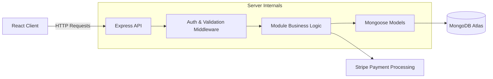

# Meal-Cage Server 🍔

The backend server for Meal-Cage, a robust RESTful API built to handle restaurant operations, user management, and secure transactions.

## 🛠️ Tech Stack

- **Runtime**: [Node.js](https://nodejs.org/) (v24.x)
- **Framework**: [Express.js](https://expressjs.com/)
- **Database**: [MongoDB](https://www.mongodb.com/) with [Mongoose](https://mongoosejs.com/)
- **Authentication**: [JSON Web Token (JWT)](https://jwt.io/)
- **Payments**: [Stripe](https://stripe.com/)

## 🏗️ Architecture View



## 📂 API Modules

The server is organized into modular components:

- **Auth**: Secure JWT-based authentication.
- **Users**: User profiles and role-based access control (RBAC).
- **Menu**: CRUD operations for restaurant offerings.
- **Cart**: Managing user selection for ordering.
- **Bookings**: Reservation and table management.
- **Payments**: Handling secure checkout flows.

## ⚙️ Getting Started

### Prerequisites

- Node.js (v24.x recommended)
- MongoDB Connection String

### Installation

1. Clone the repository:
   ```bash
   git clone https://github.com/Rafiuzzamanrion/Meal-Cage-Server.git
   ```
2. Install dependencies:
   ```bash
   npm install
   ```
3. Create a `.env` file in the root and add your configuration:
   ```env
   PORT=5000
   DB_USER=your_db_user
   DB_PASS=your_db_password
   ACCESS_TOKEN_SECRETE=your_jwt_secret
   PAYMENT_SECRETE_KEY=your_stripe_secret
   ```
4. Start the server:
   ```bash
   # Development mode (with nodemon)
   npm run dev
   
   # Production mode
   npm start
   ```

## 🚀 Deployment

This server is optimized for deployment on **Vercel**. Ensure your `engines` in `package.json` is set to `"node": "24.x"` for compatibility.

## 📄 License

This project is licensed under the ISC License.
